= plain-common-lisp
:toc:
:toclevels: 4

:url-cl:           https://common-lisp.net
:url-releases:     https://github.com/pascalcombier/plain-common-lisp/releases
:url-plainstarter: https://github.com/pascalcombier/plain-starter
:url-quicklisp:    http://blog.quicklisp.org
:url-asdf:         https://asdf.common-lisp.dev
:url-defsystem:    https://asdf.common-lisp.dev/asdf.html=The-defsystem-form
:url-ql-releases:  https://www.quicklisp.org/beta/releases.html
:url-zach:         https://www.xach.com
:url-slime:        https://slime.common-lisp.dev/doc/html
:url-emacs:        https://www.gnu.org/software/emacs
:url-fare-1:       http://fare.tunes.org/files/asdf3/asdf3-2014.html
:url-fare-2:       http://fare.tunes.org/files/asdf3/scripting-slides.pdf
:url-sbcl:         http://www.sbcl.org
:url-save-and-die: http://www.sbcl.org/manual/=Function-sb_002dext-save_002dlisp_002dand_002ddie)
:url-asdf-tuto:    https://fare.livejournal.com/176185.html
:url-asdf-10:      http://fare.tunes.org/files/asdf3/asdf3-2014.pdf
:url-iup:          http://webserver2.tecgraf.puc-rio.br/iup/
:url-uiop:         https://asdf.common-lisp.dev/uiop.pdf

== Document versioning

[cols="2,2,3,5",options="header"]
|========================================================
| Version | Date       | Author         | Comment
| v0.1    | 2022-07-17 | Pascal COMBIER | Initial release
|========================================================

== Introduction

plain-common-lisp is a lightweight framework created to make it easier for
software developers to develop and distribute {url-cl}[Common Lisp]’s
applications on Microsoft Windows:

1. Download the {url-releases}[latest release] of plain-common-lisp
2. Extract the archive in your workspace
3. Done: you have a decent <<bookmark-quicklisp,Quicklisp-enabled>> and <<bookmark-slime,SLIME-compatible>> Common Lisp's distribution on Windows!

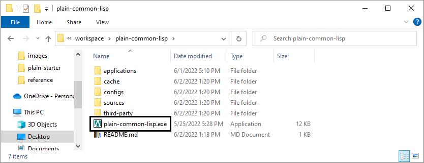
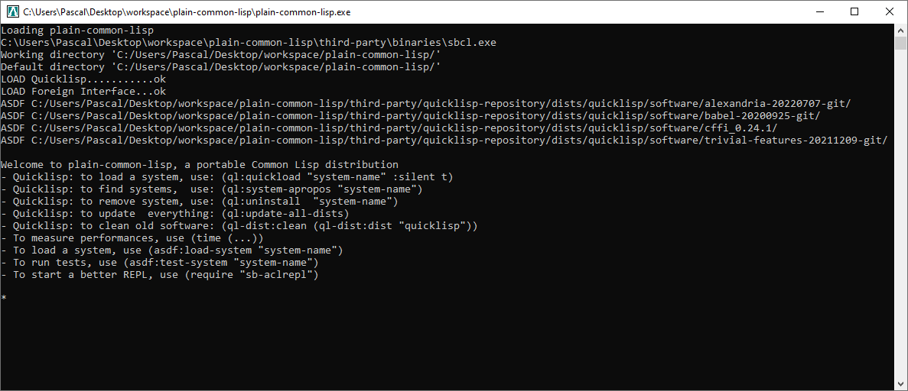

At this point, the Common Lisp's REPL is ready and the user can already work
with all {url-ql-releases}[the third-party libraries] available from Quicklisp!
This makes Common Lisp a good candidate for writing {url-fare-1}[small programs]
and {url-fare-2}[utilities]. Thousands of Common Lisp's libraries are available,
to give an example, one can install a HTTP library and start to use it
immediately:

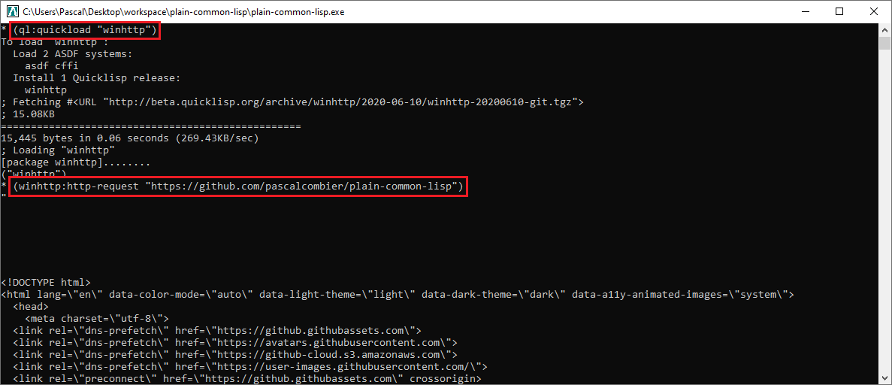

The changes are persistent: libraries are still available after a
plain-common-lisp restart.

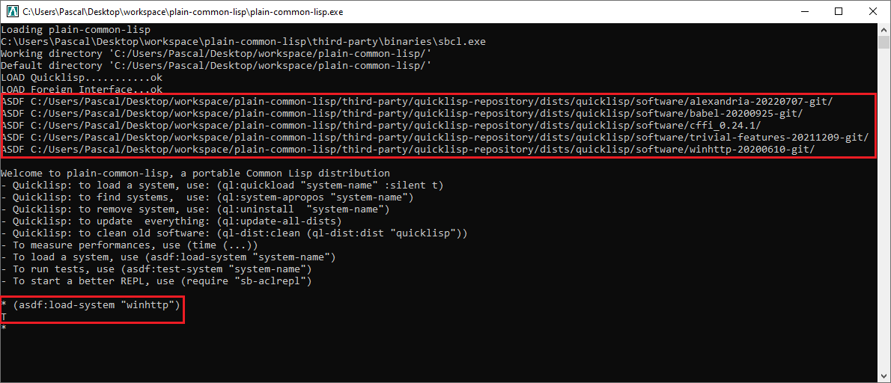

plain-common-lisp is basically a ready-to-use distribution of {url-sbcl}[SBCL]
and {url-quicklisp}[Quicklisp]. The distribution is small and contains a few
files.

```
plain-common-lisp
│   plain-common-lisp.exe
│   README.md
├───applications
├───cache
├───configs
│       plain-common-lisp.cfg
├───sources
│   └───lisp
│           pcl-loader.lisp
└───third-party
    ├───binaries
    │   │   sbcl.core
    │   │   sbcl.exe
    │   └───contrib (SBCL's fasl files)
    └───quicklisp
            quicklisp.lisp
```

To keep the plain-common-lisp archive small, Quicklisp is not included. For that
reason, the first startup might be a little bit slow because plain-common-lisp
will:

* Download and install the last version of Quicklisp from the Internet

* Compile the Lisp code and store the compilation results into the "cache"
  directory

The following executions should be much faster.

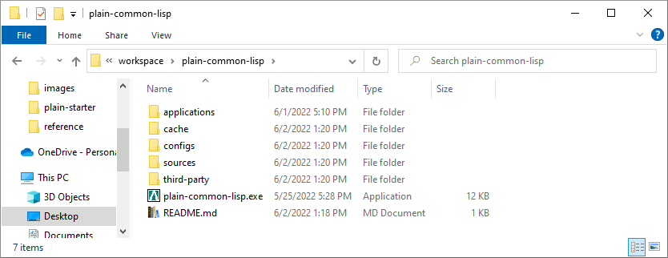
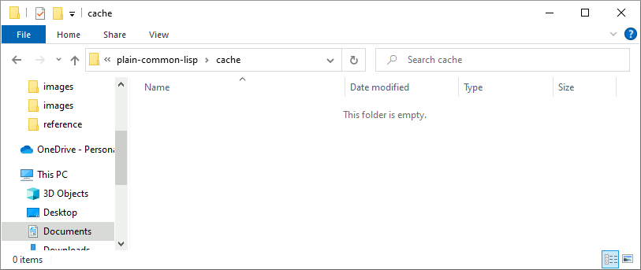

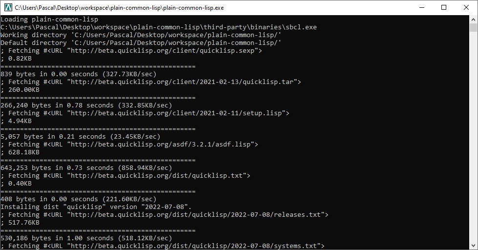
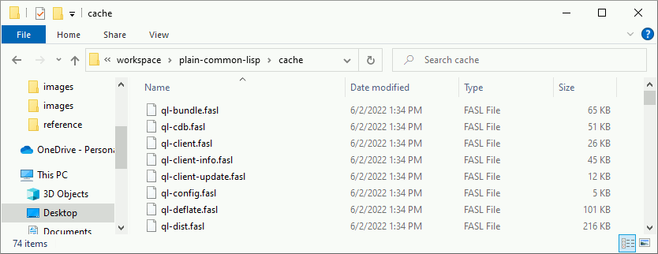


== Examples

This chapter will describe how to use the plain-common-lisp project to develop
and distribute several applications. These examples can be downloaded fom
{url-releases}[the releases area] of plain-common-lisp.

=== Console Hello World! 

Let's write a _Hello-World_ application with plain-common-lisp. To do that, we
just need to extract the last release of plain-common-lisp project:

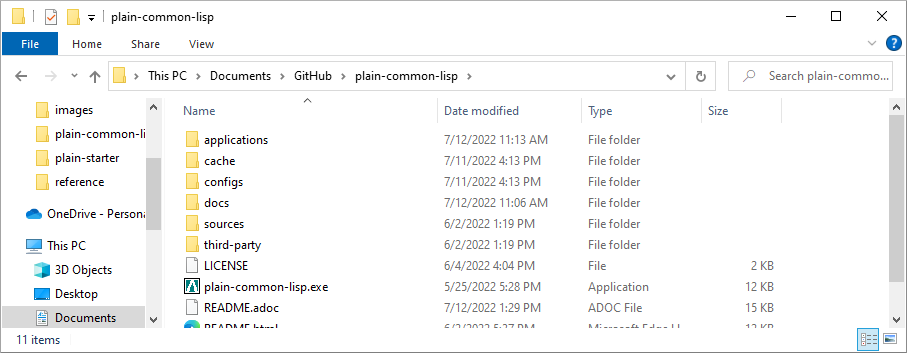

Initially, the "applications" directory is empty:

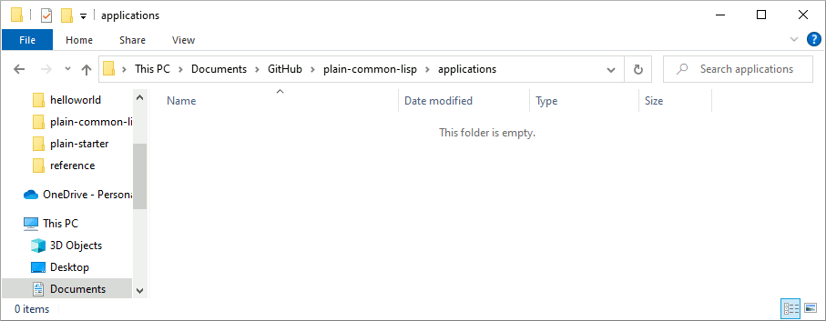

This complete example is also available in the {url-releases}[latest release] of
plain-common-lisp. We first need to create a directory "hello-world" and follow
plain-common-lisp directory structure.

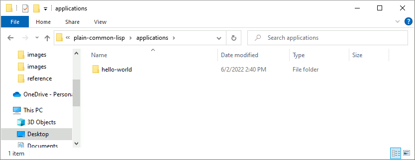
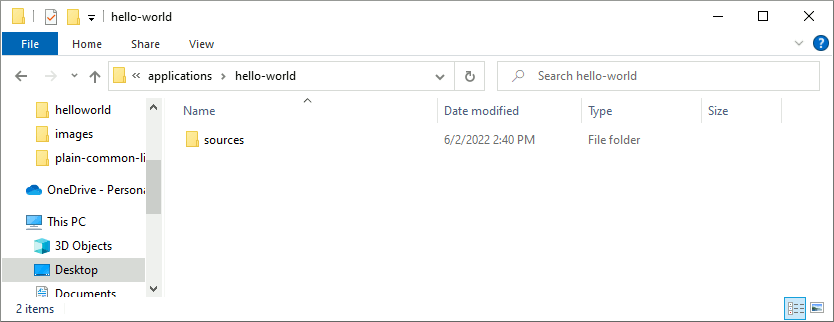

In this hello-world project, the "third-party" directory will not be used. The
"sources" directory of the application "hello-world" contains the source
code. Nothing specific to plain-common-lisp here, this structure is common to
most Common Lisp's projects.

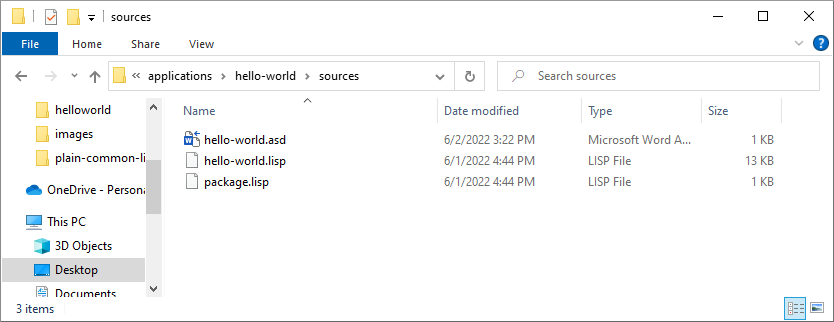

The "hello-world.asd" defines the way to compile the source code of the
application. The format is {url-defsystem}[documented in the ASDF project].

[source,lisp]
----
;;; +----------+-------------------------------------------------------+
;;; | Info     | Value                                                 |
;;; +----------+-------------------------------------------------------+
;;; | Filename | hello-world.asd                                       |
;;; | Project  | plain-command-lisp-examples                           |
;;; +------------------------------------------------------------------+

(asdf:defsystem #:hello-world
    :description "Hello world for plain-common-lisp"
    :author      "Pascal COMBIER"
    :license     "BSD"
    :components
     ((:file "package")
      (:file "hello-world" :depends-on ("package"))))
----

The "package.lisp" file describe the package "hello-world" which exports the "main" function:

[source,lisp]
----
;;; +----------+-------------------------------------------------------+
;;; | Info     | Value                                                 |
;;; +----------+-------------------------------------------------------+
;;; | Filename | package.lisp                                          |
;;; | Project  | plain-command-lisp-examples                           |
;;; +----------+-------------------------------------------------------+

(defpackage #:hello-world
  (:use
   #:common-lisp)
  (:export #:main))
----

The file "hello-world.lisp" implements the "main" function.

[source,lisp]
----
;;; +----------+-------------------------------------------------------+
;;; | Info     | Value                                                 |
;;; +----------+-------------------------------------------------------+
;;; | Filename | hello-world.lisp                                      |
;;; | Project  | plain-command-lisp-examples                           |
;;; +----------+-------------------------------------------------------+

(in-package :hello-world)

;;--------------------------------------------------------------------;;
;; IMPLEMENTATION                                                     ;;
;;--------------------------------------------------------------------;;

(defun main ()
  (format t "Hello World!~%"))
----

It's trivial to test such application because all the applications in the
 "applications" directory are automatically registred to ASDF at
 plain-common-lisp's startup:

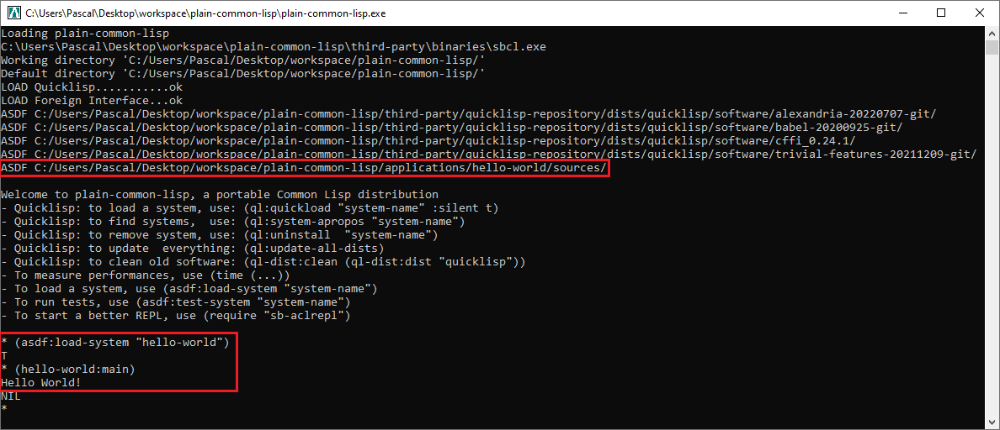

To distribute this application, one way could be to distribute it with its
source code. An easy approach would be to use the
{url-plainstarter}[plain-starter] project. To do that, simply _duplicate_
"plain-common-lisp.exe" into "hello-world.exe".

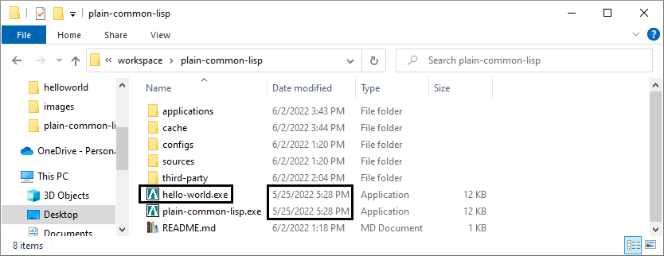

Then, it's also needed to duplicate "configs/plain-common-lisp.cfg" into
"configs/hello-world.cfg".

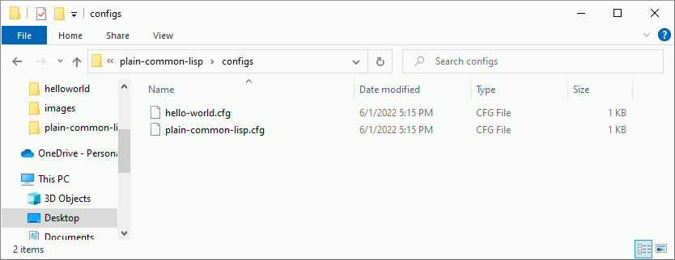

Then we would need to add a special file in the applications directory:

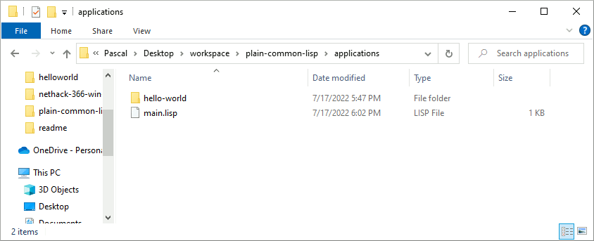

.main.lisp
[source,lisp]
----
(asdf:load-system "hello-world")
(hello-world:main)
----

Obviously, launching "hello-world.exe" will start our application:

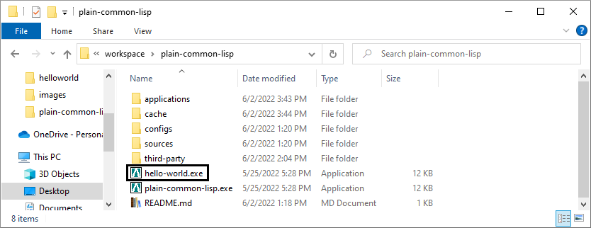
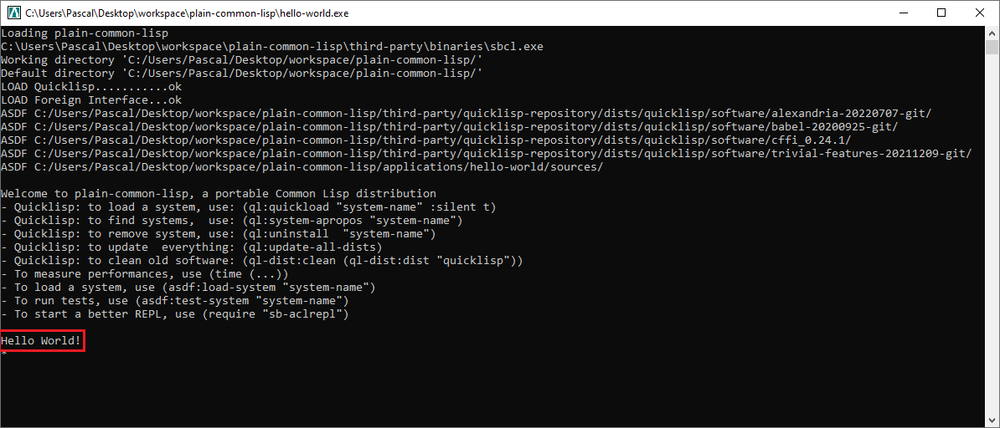

The last step before creating a ZIP file and distribute this application would
be to delete the unnecessary files: "plain-common-lisp.exe",
"configs/plain-common-lisp.cfg" and remove all the files from the cache
directory.

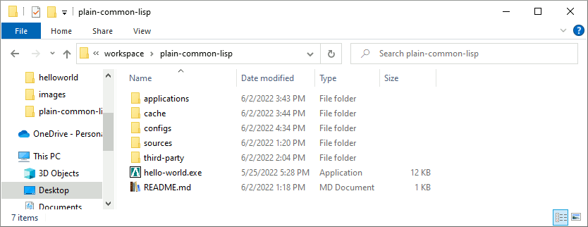

Another way would be to distribute this application as a binary file, without
any source code. This can be achieved by using the
{url-save-and-die}[save-lisp-and-die] function from SBCL.

[source,lisp]
----
(sb-ext:save-lisp-and-die "hello-world-prod.exe" :toplevel #'hello-world:main :executable t :compression t)
----

Note that the "compression" flag is not mandatory here. It's a SBCL feature
which is not always enabled on the offical SBCL binaries for Windows. The SBCL
binaries of plain-common-lisp's always have this feature activated, allowing to
trade a little bit of startup time for a smaller binary size.

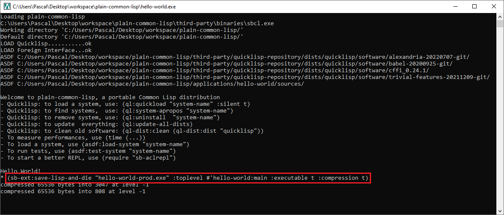
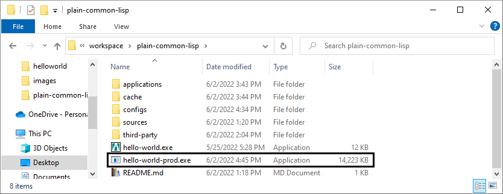
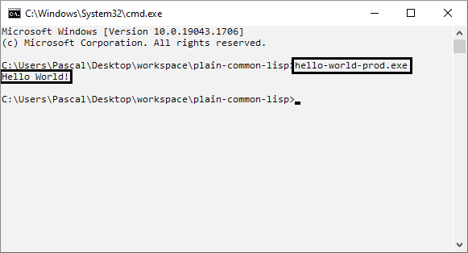

=== The applications directory

The applications directory contains directories. Each of these directory is
composed of:

* One or several ASDF systems available in the _sources_ directory. A ASDF
  system is a directory containing a 'asd' file and the associated Lisp files.

* Third-party Lisp code can be stored in _third-party/sources_. This is rarely
  needed but can be useful if there is some Lisp dependancies not available in
  Quicklisp. In such case, it's simply needed to copy the ASDF system directory
  in this _third-party/sources/my-dependancy/_ directory. Obviously, this
  directory will also need to contain the ASDF system with the 'asd' file.

* System-specifc binaries can be stored in the _third-party/bin_ directory. This
  is required if the system is using DLL files.

== External references

* [[bookmark-quicklisp]]{url-quicklisp}[Quicklisp] is the fantastic library
manager for Common Lisp developped by {url-zach}[Zach Beane]. Note that
Quicklisp is unaffiliated to plain-common-lisp's project.

* [[bookmark-slime]]{url-slime}[SLIME] is a powerful mode for {url-emacs}[GNU
Emacs] allowing to write programs in an interactive and incremental way.

* {url-asdf}[ASDF] is the de-facto standard tool to build Common Lisp
software. It has been maintained {url-asdf-10}[over 10 years] and
    {url-asdf-tuto}[greatly documented] by the outstanding François-René Rideau.
