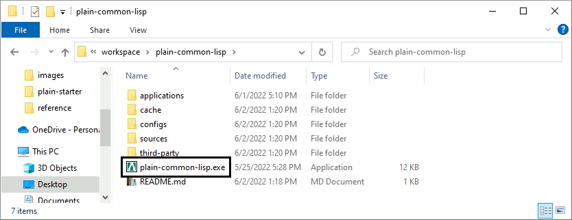
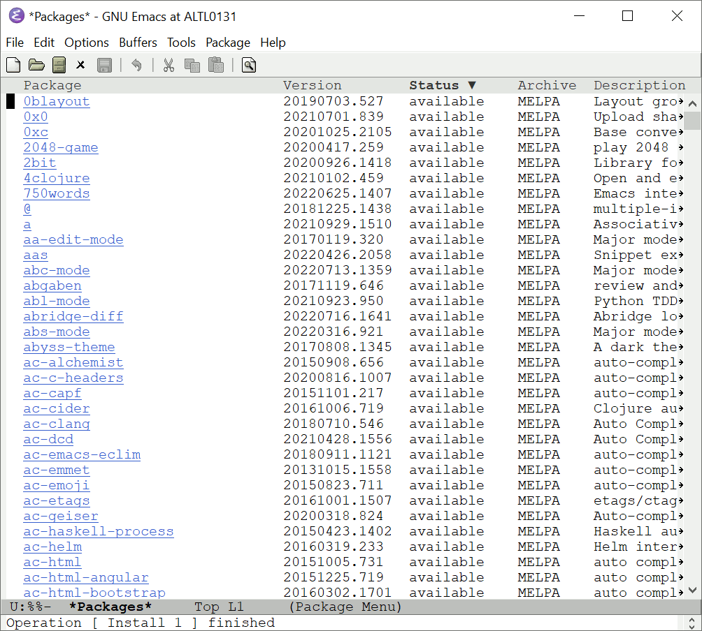
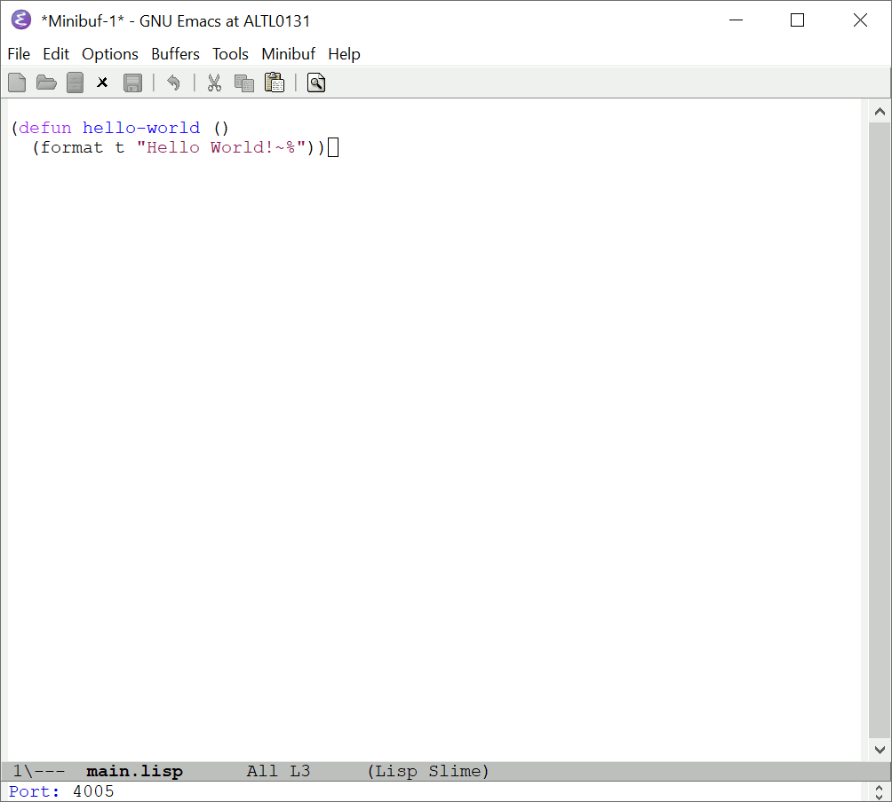

= plain-common-lisp
:toc:
:toclevels: 4

:url-cl:           https://common-lisp.net
:url-releases:     https://github.com/pascalcombier/plain-common-lisp/releases
:url-plainstarter: https://github.com/pascalcombier/plain-starter
:url-quicklisp:    http://blog.quicklisp.org
:url-asdf:         https://asdf.common-lisp.dev
:url-defsystem:    https://asdf.common-lisp.dev/asdf.html=The-defsystem-form
:url-ql-releases:  https://www.quicklisp.org/beta/releases.html
:url-zach:         https://www.xach.com
:url-slime:        https://slime.common-lisp.dev/doc/html
:url-emacs:        https://www.gnu.org/software/emacs
:url-fare-1:       http://fare.tunes.org/files/asdf3/asdf3-2014.html
:url-fare-2:       http://fare.tunes.org/files/asdf3/scripting-slides.pdf
:url-sbcl:         http://www.sbcl.org
:url-save-and-die: http://www.sbcl.org/manual/=Function-sb_002dext-save_002dlisp_002dand_002ddie)
:url-asdf-tuto:    https://fare.livejournal.com/176185.html
:url-asdf-10:      http://fare.tunes.org/files/asdf3/asdf3-2014.pdf
:url-iup:          http://webserver2.tecgraf.puc-rio.br/iup/
:url-uiop:         https://asdf.common-lisp.dev/uiop.pdf
:url-zstd:         https://github.com/facebook/zstd

== Document versioning

[cols="2,2,3,5",options="header"]
|==========================================================
| Version | Date       | Author         | Comment
| v0.1    | 2022-07-17 | Pascal COMBIER | Initial release
| v0.2    | 2022-07-23 | Pascal COMBIER | Add SLIME chapter
|==========================================================

== Introduction

plain-common-lisp is a lightweight framework created to make it easier for
software developers to develop and distribute {url-cl}[Common Lisp]’s
applications on Microsoft Windows:

1. Download the {url-releases}[latest release] of plain-common-lisp
2. Extract the archive in your workspace
3. Done: you have a decent <<bookmark-quicklisp,Quicklisp-enabled>> and <<bookmark-slime,SLIME-compatible>> Common Lisp's distribution on Windows!


image::docs/images/readme/06-repl.png[screenshot]

At this point, the Common Lisp's REPL is ready and the user can already work
with all {url-ql-releases}[the third-party libraries] available from Quicklisp!
This makes Common Lisp a good candidate for writing {url-fare-1}[small programs]
and {url-fare-2}[utilities]. Thousands of Common Lisp's libraries are available,
to give an example, one can install a HTTP library and start to use it
immediately:

image::docs/images/readme/07-winhttp-highlight.png[screenshot]

The changes are persistent: the installed libraries will be available after a
restart.


plain-common-lisp is basically a ready-to-use distribution of {url-sbcl}[SBCL]
and {url-quicklisp}[Quicklisp]. The distribution is small and only contains a few
files.

```
plain-common-lisp
│   plain-common-lisp.exe
│   README.md
├───applications
├───cache
├───configs
│       plain-common-lisp.cfg
├───sources
│   └───lisp
│           pcl-loader.lisp
└───third-party
    ├───binaries
    │   │   sbcl.core
    │   │   sbcl.exe
    │   └───contrib (SBCL's fasl files)
    └───quicklisp
            quicklisp.lisp
```

To keep the plain-common-lisp archive small, Quicklisp is not included. For that
reason, the first startup might be a little bit slow because plain-common-lisp
will:

* Download and install the last version of Quicklisp from the Internet

* Compile the Lisp code and store the compilation results into the "cache"
  directory

The following executions should be much faster.


image::docs/images/readme/02-workspace-cache-empty.png[screenshot]

image::docs/images/readme/04-first-execution.png[screenshot]
image::docs/images/readme/05-workspace-cache-populated.png[screenshot]
image::docs/images/readme/06-repl.png[screenshot]

=== Install SLIME on GNU Emacs

This chapter is based on a fresh installation of the vanilla GNU Emacs. The
default package repository contains an old SLIME version which is not working
properly. The third-party repository MELPA contains a good version. The first
step is to add this MELPA repository to GNU Emacs.


Press `Alt-x` and then enter the command `customize-variable`.


Input `package-archives`.


Click on `INS` to insert a new repository:

- Name: MELPA
- URL: https://melpa.org/packages/


Click on "STATE" and then "Save for Future Sessions".


Restart GNU Emacs. This is not techically required but slighly simplier to
document.


Press `Alt-x` and then enter the command `list-packages`. Wait a few seconds for
the package list to be downloaded.


Find the MELPA version of "SLIME" and press `i` the mark the software for installation.


Press `x` to start the installation.


That's done, SLIME is installed on GNU Emacs.



=== Install SWANK in plain-common-lisp

This chapter is based on a fresh installation of plain-common-lisp.


Install SWANK from Quicklisp with the command `(ql:quickload "swank")`.


One can start a SWANK server with the function `(swank:create-server)` which
will create a local server. By default, this server will listen on the port
4005. This function will need to be called each time the application is
executed.


Create a new Lisp file in the "applications" directory.


For example, one can write a hello-world function.


At this stage, let's try to make Emacs connect to the plain-common-lisp
process. Press `Alt-x` and type the command `slime-connect`.


When prompted about which host to use, just validate: the default host
`localhost` is perfectly fine.


When prompted about which port to use, just validate: the default port
`4005` is perfectly fine.



That's it, SLIME is started and connected to the plain-common-lisp process.


To compile the `hello-world` function and send it to plain-common-lisp, it is
simply needed to type `Ctrl-c Ctrl-c`. The result of the compilation will appear
in the terminal below the source code. One can directly test the hello-world
function by jumping in the REPL and typing the Common Lisp code `(hello-world)`.


This is exactly why it is named _interactive_. The programmer write a function
in its source code and test it immediately. If the function is working, the
developer can save the file and then write a new function. The development of
the program is done step-by-step in a incremental way.

In most of Common Lisp's programs there are different packages. By default,
SLIME starts in the standard package `common-lisp-user` also named
`CL-USER`. All the functions will be created in this package. If one want to
switch to another package, he can:

- Press `Alt-x` and then type the command `slime-repl-set-package`
- Use the shortcut `Ctrl-c` then `Alt-p`

The package names can be automatically completed when pressing the `TAB` key.

In the example below, we have created a package "hello" exporting the "main"
function. Then we asked SLIME to jump inside this package. At this point, we
implemented the "main" function and tested it.


=== Make the SLIME configuration persistent

A full example is available and can be downloaded from {url-releases}[the
releases area] of plain-common-lisp. We can make the assumption that the SWANK
server might not be needed when delivering the application to the users. So it
could be reasonable to consider 2 environments:

- Development environment, starting SWANK server automatically
- Production environment, without any SWANK server

Creating a new environment simply means duplicating 2 files. Duplicate
"plain-common-lisp.exe" into "plain-common-lisp-dev.exe". Duplicate
"configs/plain-common-lisp.cfg" into "configs/plain-common-lisp-dev.cfg".


Then one simply need to write the "plain-common-lisp-dev" application startup
file named "plain-common-lisp-dev.lisp".


.plain-common-lisp-dev.lisp
[source,lisp]
----
(asdf:load-system "swank")
(swank:create-server)
----

When the program "plain-common-lisp-dev.exe" will be executed, it will try to
load and execute the file "applications\plain-common-lisp-dev.lisp". This
startup file will load SWANK and create a server.

After that, we can just run the application "plain-common-lisp-dev.exe" and
connect with SLIME from GNU Emacs. The SWANK server is started automatically.


== Known issues

=== SLIME does not work when spawning plain-common-lisp executables

This method is unfortunately not currently supported. The reason is technical,
the SWANK package from Quicklisp implements its own FASL binaries relocation
scheme. It does it in a way which is not compatible with plain-common-lisp.


The FASL files from plain-common-lisp and SWANK being located in different
directories, plain-common-lisp startup meets an error when loading SWANK. If one
successfuly modify SWANK so that he don't implement any custom FASL redirection,
this issue would probably be solved.

=== plain-common-lisp directories cannot be moved or renamed after initial installation

This issue is known and being analysed. Current work-around: delete all the
files from the cache directory.

== External references

* [[bookmark-quicklisp]]{url-quicklisp}[Quicklisp] is the fantastic library
manager for Common Lisp developped by {url-zach}[Zach Beane]. Note that
Quicklisp is unaffiliated to plain-common-lisp's project.

* [[bookmark-slime]]{url-slime}[SLIME] is a powerful mode for {url-emacs}[GNU
Emacs] allowing to write programs in an interactive and incremental way.

* {url-asdf}[ASDF] is the de-facto standard tool to build Common Lisp
software. It has been maintained {url-asdf-10}[over 10 years] and
    {url-asdf-tuto}[greatly documented] by the outstanding François-René Rideau.
